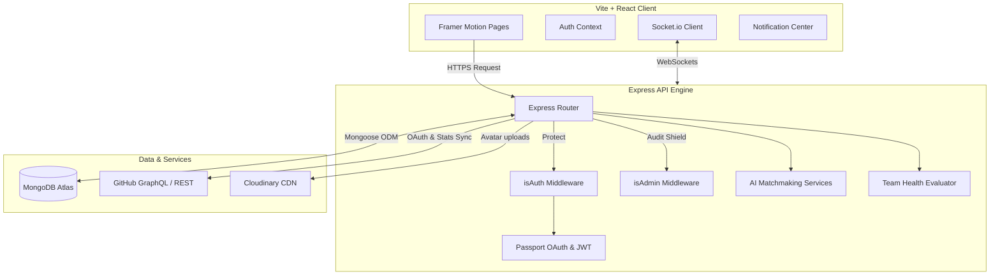

# 🚀 HackMate AI — Full-Stack Developer Matchmaking & Team Builder

[](https://mongodb.com)
[](https://socket.io)
[](https://framer.com/motion)
[](LICENSE)

**HackMate AI** is a premium, full-stack MERN production application designed to eliminate the biggest bottleneck in hackathons: **finding the right teammates**. By combining Tinder-style swipe discovery, AI-driven compatibility matching, verified GitHub portfolio scores, real-time messaging, and team health analytics, HackMate AI empowers developers to build high-performance, cross-functional teams in minutes.

---

## 🧭 Live Demo & Visuals

- **Frontend Development Server**: `http://localhost:5174/`
- **Backend API Engine**: `http://localhost:5000/`

> **Note**: For a preview of the premium glassmorphic Admin panel and the live search interfaces, see the project walk-throughs and screenshots in the local documentation folders.

---

## ⚡ Key Features

### 1. 🎴 Tinder-Style Swipe Discovery Feed
- Responsive Tinder-like card swiping built with **Framer Motion** physics.
- High-fidelity swipe gestures (Swipe Right to Like, Left to Pass, Up to Super-Like).
- Mutually interested users trigger a real-time **Match Modal** pop-up.

### 2. 🧠 AI Matchmaking & Team Health Engine
- **Compatibility Index**: Server-side engine calculates alignment percentages between developers based on overlapping skills, complementary roles, and experience levels.
- **Team Health Analytics**: Analyzes team configurations against required hackathon roles, outputs a "Synergy Score," and provides active AI-powered recommendations for recruiting missing roles.

### 3. 🐙 Verified GitHub Integration
- One-click GitHub portfolio verification.
- Automates data extraction of active repositories, total star counts, language distributions, and contribution history.
- Computes a secure **GitHub Score** to filter bot accounts and verify developers' real-world capabilities.

### 4. 💬 Real-Time Messaging & Presence
- Interactive chat rooms built on **Socket.io** using WebSockets.
- Includes dynamic typing indicators, read/unread message statuses, message histories, and active user presence flags (Online/Offline).

### 5. 🔔 Real-Time Alert Center
- Real-time in-app notifications for chat messages, incoming likes, new matches, and team invitations.
- Header-mounted Notification Bell displaying live counts.

### 6. 🔍 Advanced Multi-Filter Search
- Sidebar filter combinations: Role multi-select, Skills multi-select, College text search, City text search, and GitHub Score range sliders.
- Instant server-side index queries at `/api/users/search` to locate specific teammate profiles.

### 7. 🛡️ Protected Admin Command Center
- Role-based route shields (`isAdmin`) to prevent unauthorized access.
- **Analytics View**: High-level telemetry displaying active user ratios, matched ratios, and total teams.
- **User Audits**: Direct interfaces to search users, edit roles, and toggle instant Bans (`isBanned`).
- **Team Rosters**: Lists all created hackathon rosters with options to audit or disband teams.

---

## 🏗️ Architecture & System Design



### Technical Design Decisions:
- **Monorepo Architecture**: Clean separation of `client/` and `server/` components.
- **Secure Authentication**: JWT-based access tokens with secure httpOnly refresh token cookies. Backed by Google & GitHub OAuth via Passport.js.
- **Database Schema**: Structured relations in MongoDB via Mongoose, using indexes on `googleId`, `githubId`, and query parameters to optimize discovery feed latency.

### 💬 Real-Time Chat & Fast Media Upload Architecture

To ensure a seamless, high-performance user experience, the real-time chat and media upload systems are optimized end-to-end:

#### 1. Instant WebSocket Message Delivery & Rendering
- **Event-Driven WebSockets (Socket.io)**: Standard HTTP polling is bypassed. Messages, status changes, and typing indicators are delivered instantly via bi-directional WebSockets.
- **Client-Side Optimistic UI Updates**: When a message is sent, the client generates a unique `tempId` and immediately renders the message in a `sending` state. Once the server saves and broadcasts the message, the client aligns the IDs and updates the status badge with zero layout shifts or lag.
- **In-Memory Presence Engine**: The backend maintains a live `Map` matching connected User IDs to their corresponding active socket sessions. This allows the backend to resolve the delivery status of new messages (`deliveredTo` field) instantly without querying the database.
- **Cursor-Based DB Pagination**: Historical message retrieval utilizes Mongoose cursor-based pagination based on message `createdAt` timestamps, avoiding costly offset queries when chat histories grow.
- **Batched DB Reads/Deliveries**: When a user connects or opens a chat room, read and delivery receipts are resolved in single-query batches (`updateMany`) rather than single-document updates, drastically reducing DB connection overhead.

#### 2. Fast Image & Video Upload Pipeline
- **Client-Side Canvas Image Compression**: Large JPG/PNG/WEBP files are intercepted and compressed on the client using HTML5 Canvas (`compressImage` utility) prior to upload. PNGs are dynamically converted to JPEGs, reducing file sizes by up to 90% and minimizing user bandwidth consumption.
- **Direct Memory Buffer Proxying**: The backend utilizes Multer in memory mode (`multer.memoryStorage()`) to hold file chunks in RAM. This bypasses disk I/O operations entirely. The file buffer is converted to a base64 Data URI stream and uploaded directly to Cloudinary.
- **Axios Upload Progress Tracking**: Custom hooks capture upload progress events via `onUploadProgress` and display a real-time progress percentage, keeping users informed and providing immediate feedback.
- **Decoupled Upload Lifecycle**: The file upload process is completely isolated from the message-sending pipeline. The file is uploaded in the background first. The actual chat message is sent only with the final secured CDN URL as metadata, avoiding socket payload bloating.
- **Cloudinary CDN Auto-Optimization**: Uploaded assets are handled with `resource_type: 'auto'` and `fetch_format: 'auto'`. Cloudinary serves the media through globally distributed edge caches, serving optimized WebP/AVIF formats based on the client browser.

---

## 🛠️ Tech Stack

### Frontend
- **Framework**: React 19 (Vite)
- **Styling**: Vanilla CSS + TailwindCSS (harmonious dark mode gradients, glassmorphism)
- **Animations**: Framer Motion
- **Icons**: React Icons (FontAwesome / Canvas)
- **Sockets**: Socket.io-client

### Backend
- **Server**: Node.js + Express
- **Real-Time**: Socket.io
- **ODM**: Mongoose (MongoDB)
- **Authentication**: JWT, bcryptjs, Passport.js (Google & GitHub OAuth2)
- **Image Storage**: Cloudinary SDK
- **Rate Limiter**: Express Rate Limit

---

## ⚙️ Getting Started

### Prerequisites
- Node.js (v18+)
- MongoDB Atlas account (or local MongoDB server)
- GitHub OAuth application credentials
- Cloudinary account credentials

### Environment Configurations

Create a `.env.local` file inside the `server/` directory and configure the following variables:

```ini
PORT=5000
MONGO_URI=your_mongodb_connection_string
JWT_SECRET=your_jwt_access_token_secret
JWT_REFRESH_SECRET=your_jwt_refresh_token_secret

GOOGLE_CLIENT_ID=your_google_client_id
GOOGLE_CLIENT_SECRET=your_google_client_secret
GOOGLE_CALLBACK_URL=http://localhost:5000/api/auth/google/callback

GITHUB_CLIENT_ID=your_github_client_id
GITHUB_CLIENT_SECRET=your_github_client_secret
GITHUB_CALLBACK_URL=http://localhost:5000/api/auth/github/callback

CLOUDINARY_CLOUD_NAME=your_cloudinary_cloud_name
CLOUDINARY_API_KEY=your_cloudinary_api_key
CLOUDINARY_API_SECRET=your_cloudinary_api_secret

CLIENT_URL=http://localhost:5174
```

### Installation

1. **Clone the repository**:
   ```bash
   git clone https://github.com/yourusername/Hackmate.git
   cd Hackmate
   ```

2. **Setup Server**:
   ```bash
   cd server
   npm install
   npm run dev
   ```

3. **Setup Client**:
   ```bash
   cd ../client
   npm install
   npm run dev
   ```
   *Note: If port `5173` is occupied, Vite will automatically serve the app on `http://localhost:5174/`.*

---

## 🔑 Test Credentials

Use these seeded database accounts to preview standard user and administrator workflows:

| Role | Email | Password | Access Rights |
| :--- | :--- | :--- | :--- |
| **Administrator** | `admin@example.com` | `Password123` | Access to protected `/admin` tabs |
| **Standard User** | `john.doe.test1@example.com` | `Password123` | Matchmaking, Swipe Feed, Profile Settings |

---

## 📄 API Reference (Quick View)

### Authentication
- `POST /api/auth/register` - Create new hacker profile.
- `POST /api/auth/login` - Local email password sign-in.
- `POST /api/auth/logout` - Clear refresh tokens.
- `GET /api/auth/me` - Fetch authenticated user details.

### Discover & Matches
- `GET /api/users/search` - Fetch hackers using multi-filters.
- `POST /api/swipes` - Register like, pass, or super-like action.
- `GET /api/swipes/interested` - List hackers who swiped right on you.

### Teams & Rosters
- `POST /api/teams` - Create a new hackathon team.
- `GET /api/teams/:id` - Fetch team member compositions and Synergy score.
- `POST /api/teams/:id/invite` - Request another hacker to join the roster.

### Administration
- `GET /api/admin/users` - Paginated audit user registry.
- `PUT /api/admin/users/:id/ban` - Restrict / Ban user from platform actions.

---

## 🎖️ Hackathon Judges / Recruiters Highlights
- **Real-world API Integrations**: Direct GitHub contribution API scraping with caching.
- **Robust Security**: Rate-limiting on core APIs, strict route guard middlewares, clean password salting, and secure cookies.
- **Impeccable UX**: Sleek glassmorphism gradients, smooth transitions, instant notifications, and clean modal interactions.
